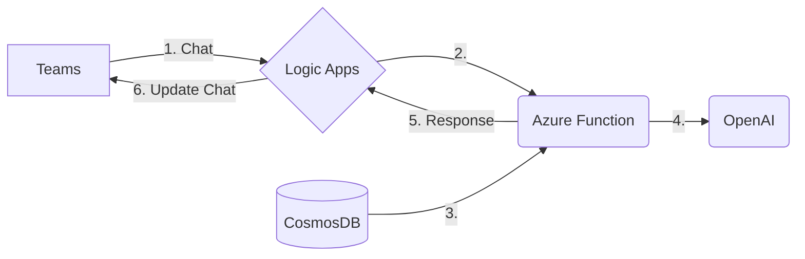

# Mini-Rag-Quickstart!

## Background

The goal of this project is to help you get up an running quickly with a build out of a RAG model. Before you dive in, if you're interested in learning more about the RAG model, you can read some of the documentation here:

> - [Hugging Face’s RAG](https://huggingface.co/docs/transformers/model_doc/rag)  documentation provides a detailed explanation of the RAG model and its implementation.
> - [RAG and generative AI](https://learn.microsoft.com/en-us/azure/search/retrieval-augmented-generation-overview) - Azure AI Search: This page provides an overview of RAG and its application in Azure AI Search.
> - [IBM’s AI RAG page](https://www.ibm.com/architectures/hybrid/genai-rag) provides a conceptual architecture of a RAG solution, showing the major components and the flow of interactions between them to respond to a user query.
> - [A Simple Guide To Retrieval Augmented Generation Language Models](https://www.smashingmagazine.com/2024/01/guide-retrieval-augmented-generation-language-models/) includes a diagram showing the generator flow in a RAG-based system.
> - [Retrieval augmented generation (RAG) explained](https://www.superannotate.com/blog/rag-explained) provides a simple diagram that shows the process of RAG at the intersection of natural language generation (NLG) and information retrieval (IR).

In general, LLM's are costly to train and customize because training requires very large GPU clusters running for extended periods of time. You can follow this in-dept discussion here:  [Efficient LLM Training](https://arxiv.org/pdf/2104.04473.pdf). The problem is made more complicated if the data is constantly changing.

To overcome the training problem customers can implement the RAG model and overcome many of the problems: 

> - **Access to External Knowledge:** RAG provides LLMs access to external knowledge through documents, resulting in contextually accurate and factual responses.
> - **Cost-Effective:** RAG is more cost-effective than fine-tuning, as it doesn’t require the labeled data and computational resources that come with model training.
> - **Improves Accuracy:** RAG improves the accuracy and contextuality of LLM-generated responses while minimizing factual inaccuracies.
> - **Up-to-Date Information:** RAG ensures that the model has access to the most current, reliable facts.
> - **Transparency:** Users have access to the model’s sources, ensuring that its claims can be checked for accuracy and ultimately trusted.
> - **Control Over Generated Text:** Organizations have greater control over the generated text output.
> - **Reduces Data Leakage:** By grounding an LLM on a set of external, verifiable facts, the model has fewer opportunities to pull information baked into its parameters. This reduces the chances that an LLM will leak sensitive data.
> - **Reduces Need for Continuous Training:** RAG reduces the need for users to continuously train the model on new data and update its parameters as circumstances evolve4.

# Project Overview

The project will allow you to incorporate openAI into 

|    | Component | Activity |
|----|-----------|----------|
| 1    | Teams     | User enters text in chat|
| 2  |  Logic App | Logic app invokes Azure function |
| 3|| Azure Function | Functions reads contents from cosmosDB |
| 4| Azure Function  | The function dynamically creates the prompt and calls OpenAI |
| 5| Azure Function | The function optionally interacts further with OpenAI but ultimately returns the response to teams  |
|6 | Logic App | The Logic App updates the conversation with the response from OpenAI |

-------------------

## Building it manually
### Create the resources:
#### 1. Create a new Teams channel

Teams will be used as the chat UI for this project.  To keep things simple, create a new team.  We'll use the general channel in this newly created team.

#### 2. Create a new Logic App

The logic app will be used to shuttle message between the chat and Azure functions.  Create a new Logic in the azure portal.

#### 3. Create a new Azure Function

The function app will be used to call the OpenAI service.  Create a new instance in the portal using Python 3.11 on Linux using the serverless option.

#### 4. Creae a new OpenAI instance 

Now for the LLM magic.  Here we'll create an openAI Instance from the portal.  Note, you will need to apply for access  ( and be accepted ) before you can instance this.  If you don't have access yet, click on [Apply for access](https://azure.microsoft.com/en-us/products/ai-services/openai-service)

You will receive an email that you have been granted access.  Once you have that, create a new instance using the S0 tier.  We'll be created a GPT-3 instance later once it has been instantiated.

#### 5. Create a new CosmosDB instance

We'll need some place to keep the data that will be used to generate the response.  We're going to keep it simple and store this information in a cosmosDB.  The cool thing about cosmosDB is that it makes it super easy to connect to AzureFunctions ( More correctly, it's actually Azure functions that makes it easy to read from comsosDB. [And a storage acct, and event hub, and a queue, etc...] )

---------------------

## Hooking it up

Overall implementing a Retrieval-Augmented Generation (RAG) model involves several steps.  But it'll take longer to read through these than to do the actual mini-RAG implementation.

> - **Define Use Case:** Start by defining the specific use case for your RAG implementation. Determine the domain or topic for which you want the Large Language Model (LLM) to generate responses augmented by retrieved information.
> - **Select an LLM:** Choose a suitable Large Language Model for your RAG implementation.
> - **Data Collection:** Collect a set of documents, also known as a corpus, that the model will use to retrieve information.
> - **Data Preprocessing:** Transform and enrich the data to make it suitable for model augmentation.
> - **Embedding:** Use an embedding model to convert the source data into a series of vectors that represent the words in the client data.
> - **Vector Database:** Store the generated embeddings in a vector database.
> - **User Query:** Receive a user input and perform a similarity measure between the collection of documents and the user input.
> - **Post-Processing:** Post-process the user input and the fetched document(s). The post-processing is done with an LLM.
> - **Response Generation:** Generate a response based on the user’s query and the retrieved documents.

### Here are the steps:

Use case: We're going to let AOAI answer some basic questions for us about our team members.  We'er going to create 1 sentence at a time in cosmos.
For these, we're going to use the cloud shell ( or your own az cli that is already logged in )

Edit the first three lines below with the correct values for your resource group, 

# Edit these values 
``    export RG=aoai-rag``
``    export COSMOS_ACCT=nvmopenaicosmosdb``
``    export COSMOS_DB=aoaidb``
# Create a new CosmosDB container
``
az cosmosdb sql container create --account-name $COSMOS_ACCT --database-name $COSMOS_DB --resource-group $RG --name facts --partition-key-path "/Id"

``
