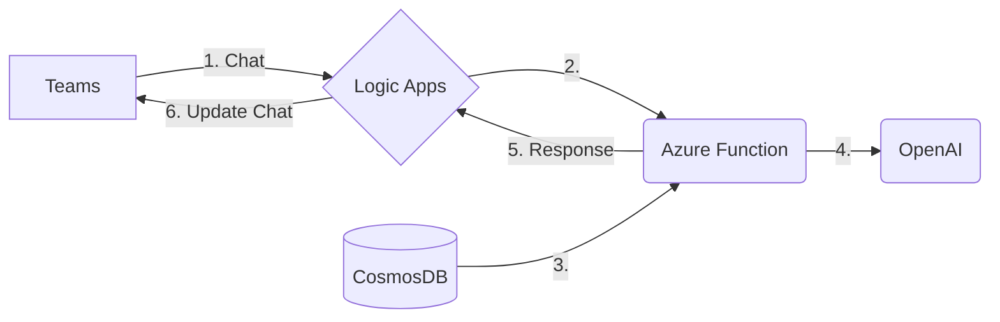

# Mini-Rag-Quickstart!

## Background

The goal of this project is to help you get up an running quickly with a build out of a RAG model. Before you dive in, if you're interested in learning more about the RAG model, you can read some of the documentation here:

- [Hugging Face’s RAG](https://huggingface.co/docs/transformers/model_doc/rag)  documentation provides a detailed explanation of the RAG model and its implementation.
- [RAG and generative AI](https://learn.microsoft.com/en-us/azure/search/retrieval-augmented-generation-overview) - Azure AI Search: This page provides an overview of RAG and its application in Azure AI Search.
- [IBM’s AI RAG page](https://www.ibm.com/architectures/hybrid/genai-rag) provides a conceptual architecture of a RAG solution, showing the major components and the flow of interactions between them to respond to a user query.
- [A Simple Guide To Retrieval Augmented Generation Language Models](https://www.smashingmagazine.com/2024/01/guide-retrieval-augmented-generation-language-models/) includes a diagram showing the generator flow in a RAG-based system.
- [Retrieval augmented generation (RAG) explained](https://www.superannotate.com/blog/rag-explained) provides a simple diagram that shows the process of RAG at the intersection of natural language generation (NLG) and information retrieval (IR).

In general, LLM's are costly to train and customize because training requires very large GPU clusters running for extended periods of time. You can follow this in-dept discussion here:  [Efficient LLM Training](https://arxiv.org/pdf/2104.04473.pdf). The problem is made more complicated if the data is constantly changing.

To overcome the training problem customers can implement the RAG model and overcome many of the problems: 

- **Access to External Knowledge:** RAG provides LLMs access to external knowledge through documents, resulting in contextually accurate and factual responses.
- **Cost-Effective:** RAG is more cost-effective than fine-tuning, as it doesn’t require the labeled data and computational resources that come with model training.
- **Improves Accuracy:** RAG improves the accuracy and contextuality of LLM-generated responses while minimizing factual inaccuracies.
- **Up-to-Date Information:** RAG ensures that the model has access to the most current, reliable facts.
- **Transparency:** Users have access to the model’s sources, ensuring that its claims can be checked for accuracy and ultimately trusted.
- **Control Over Generated Text:** Organizations have greater control over the generated text output.
- **Reduces Data Leakage:** By grounding an LLM on a set of external, verifiable facts, the model has fewer opportunities to pull information baked into its parameters. This reduces the chances that an LLM will leak sensitive data.
- **Reduces Need for Continuous Training:** RAG reduces the need for users to continuously train the model on new data and update its parameters as circumstances evolve4.

# Project Overview

The project will allow you to incorporate openAI into 

|    | Component | Activity |
|----|-----------|----------|
| 1    | Teams     | User enters text in chat|
| 2  |  Logic App | Logic app invokes Azure function |
| 3|| Azure Function | Functions reads contents from cosmosDB |
| 4| Azure Function  | The function dynamically creates the prompt and calls OpenAI |
| 5| Azure Function | The function optionally interacts further with OpenAI but ultimately returns the response to teams  |
|6 | Logic App | The Logic App updates the conversation with the response from OpenAI |

## Building it manually
## Create the resources:
### 1 Teams channel
### 2 Logic App
### 3 Azure Function
### 4 OpenAI 

## Hooking it up

